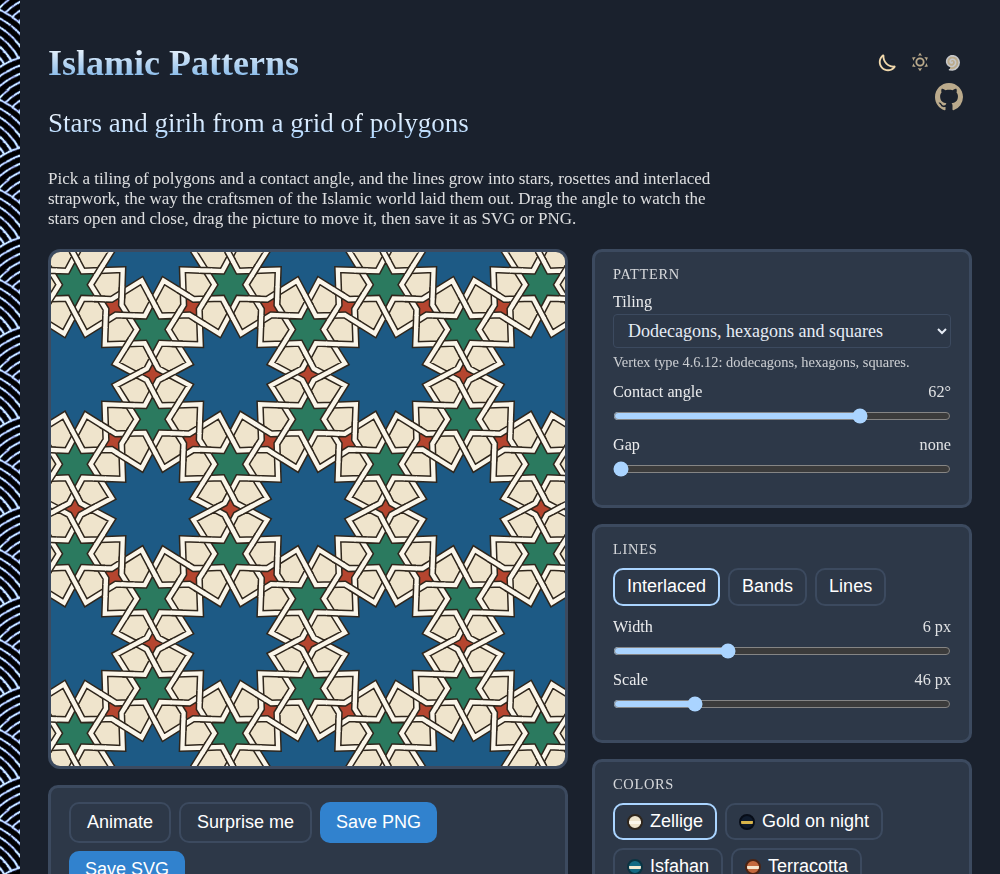
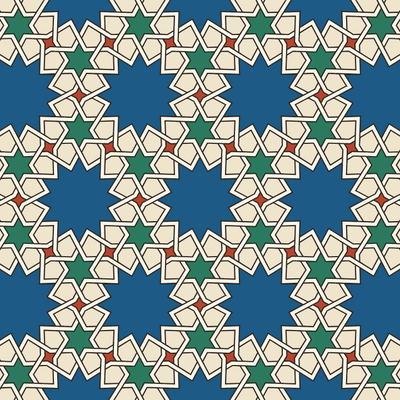
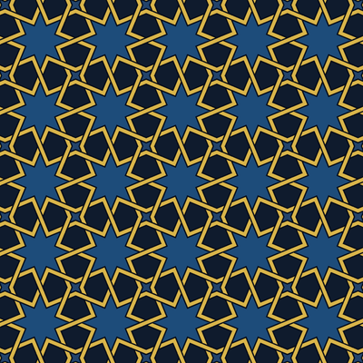
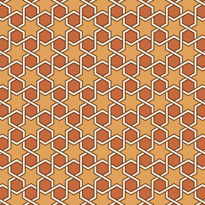
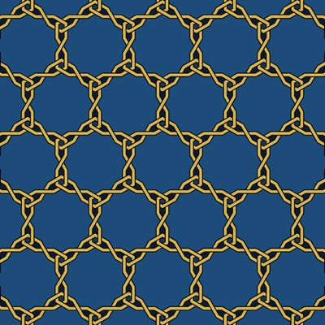
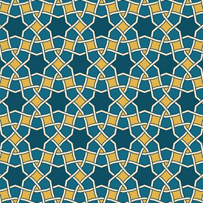
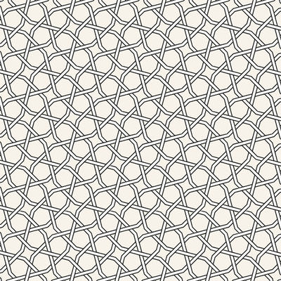

# Islamic-Patterns

Generate Islamic geometric patterns right in your browser: eight- and twelve-point stars, rosettes and interlaced strapwork (girih), grown from a tiling of polygons with Hankin's "polygons in contact" method. Change the angle and watch the stars open and close, weave the lines over and under, and save the pattern as SVG or PNG. No sign-up and no libraries.

- [Make a pattern](https://evoluteur.github.io/islamic-patterns/)

## What it does

- **Tilings**: ten tilings of regular polygons to grow the pattern from: octagons and squares (4.8.8), dodecagons, hexagons and squares (4.6.12), dodecagons and triangles (3.12.12), hexagons (6.6.6), hexagons, squares and triangles (3.4.6.4), hexagons and triangles (3.6.3.6), squares, snub squares, squares and triangles in rows, and triangles.
- **Contact angle**: from 10° to 80°, from blunt stars close to the tiling to slender ones. **Animate** sweeps it back and forth.
- **Gap**: splits each crossing point in two, for doubled lines.
- **Lines**: interlaced (over and under, alternately, all along each band), bands, or plain lines, with their width and the scale of the pattern.
- **Colors**: six palettes (Zellige, Gold on night, Isfahan, Terracotta, Ink on paper, Chalk on slate), with the stars colored by the polygon they grow from, and the tiling shown underneath if you like.
- **Classics** to start from, and **Surprise me** for a random pattern.
- **Save SVG** (vector, for printing, laser cutting or plotting) or **Save PNG** (2048 pixels square).

Drag the picture to move the pattern, double-click to center it again. The settings are kept in the address of the page, so a pattern can be shared by its link.

## Classics

Six designs to start from, all in the app under **Classics**. Click one to open it there.

<table>
  <tr>
    <td align="center" width="33%">
       
      <b>Twelve-point rosettes</b> 
      4.6.12 (dodecagons, hexagons and squares), 62°
    </td>
    <td align="center" width="33%">
       
      <b>Eight-point stars</b> 
      4.8.8 (octagons and squares), 67.5°
    </td>
    <td align="center" width="33%">
       
      <b>Six-point stars</b> 
      6.6.6 (hexagons), 60°
    </td>
  </tr>
  <tr>
    <td align="center" width="33%">
       
      <b>Dodecagon chain</b> 
      3.12.12 (dodecagons and triangles), 30°
    </td>
    <td align="center" width="33%">
       
      <b>Damascus</b> 
      3.4.6.4 (hexagons, squares and triangles), 50°
    </td>
    <td align="center" width="33%">
       
      <b>Woven squares</b> 
      3.3.4.3.4 (snub squares), 60°
    </td>
  </tr>
</table>

## How it works

The method is E. H. Hankin's (1925), as formalized by Craig S. Kaplan ("Islamic star patterns from polygons in contact", 2005), in [js/girih.js](https://github.com/evoluteur/islamic-patterns/blob/main/js/girih.js):

1. **The tiling**: each Archimedean tiling is a cell of polygons repeated along two lattice vectors, laid out to cover the picture.
2. **The rays**: from the middle of every edge, two rays go into each tile at the contact angle, crossing like an X. Each ray stops where it meets the ray from the next edge, on the bisector of the corner between them. With a gap, the two rays of an edge start from two points apart, and cross just inside the edge.
3. **The strands**: the segments are joined end to end into strands: where two meet they turn a corner, where four meet two lines cross straight through.
4. **The crossings**: at the middles of the edges, and wherever two segments cross inside a tile (found with a grid of cells, so only nearby segments are tested).
5. **The weave**: over at one crossing, under at the next, along every strand. Set one crossing, and the rule spreads to the next crossings along both strands; for a design like this one it is always consistent. Each band is drawn with its outline, then the band passing over is drawn again across the other.

The stars are colored by filling, in each tile, the outline that runs through the crossing points and the corners where the rays meet.

## How it is built

Plain HTML, CSS and JavaScript, with no dependencies and no build step. Just open `index.html`. The pattern is drawn as SVG, in a few tens of milliseconds, so it follows the sliders as you drag them. The three color themes (dark, light and blue) are shared with my other projects.

Islamic-Patterns is open source at [GitHub](https://github.com/evoluteur/islamic-patterns) with MIT license.

Had fun browsing the app? [Buy me a coffee by becoming a sponsor](https://github.com/sponsors/evoluteur).

You may also be interested in my other projects [Mandala-Maker](https://github.com/evoluteur/mandala-maker) ([demo](https://evoluteur.github.io/mandala-maker/)), [Sacred-Geometry](https://github.com/evoluteur/sacred-geometry) ([demo](https://evoluteur.github.io/sacred-geometry/)) and [Sri-Yantra](https://github.com/evoluteur/sri-yantra) ([demo](https://evoluteur.github.io/sri-yantra/)). See them all on [Esoterica](https://evoluteur.github.io/esoterica.html).

Copyright (c) 2026 [Olivier Giulieri](https://evoluteur.github.io/).
